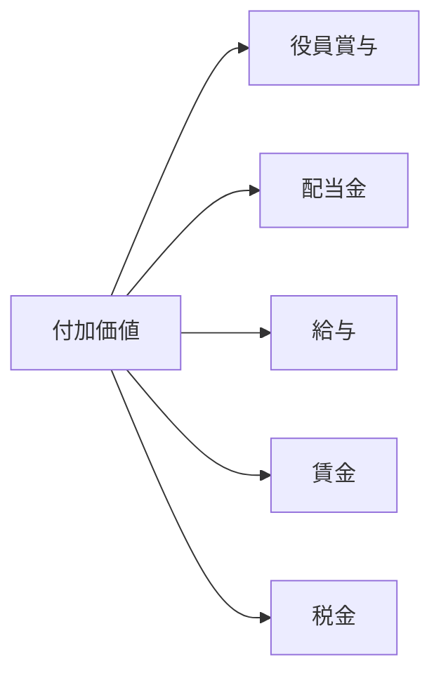

# 会計の職能、はたらき（社会的）

1. Accountability (説明責任)
2. 

## 正統性の理論

(1) 正統性の基礎
- 1. カリスマ性
- 2. 伝統（家柄）
- 3. 法律・制度

(2) 正統性の転倒（解釈替え)
- 1. 支配の正当性: 正統性の存在 => 支配
- 2. 承認の正当性: (選挙による)承認　=> 正統性

(3) 企業の正統性
- 1. 正当な企業: 成長・繁栄
- 2. 異端の企業: 衰退・廃絶

(4) 正統性戦略(企業がどのようにして社会から承認を得るか)

# 9/20
3. 意思決定有用性
(1) 会計情報(f/s) = ステークホルダーの経済的SDM

# 9/23
< 会計の論理的構造>

# 10/2
(1) 相対的 == 歴史的 == 主観的
(2) 絶対的 == 現在的 == 客観的

